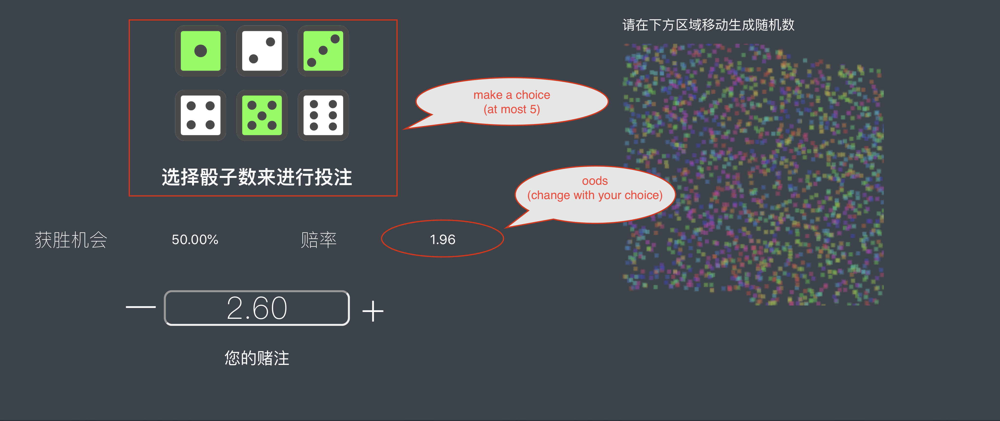
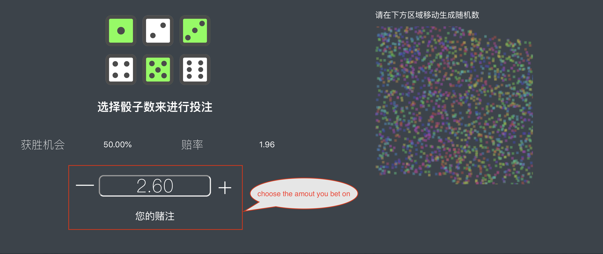
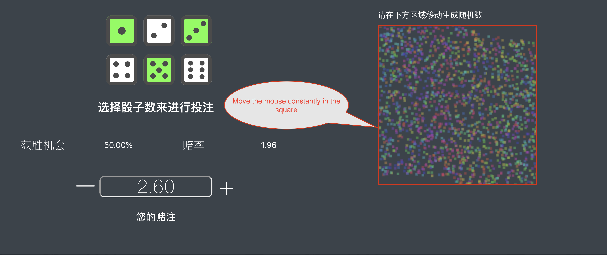
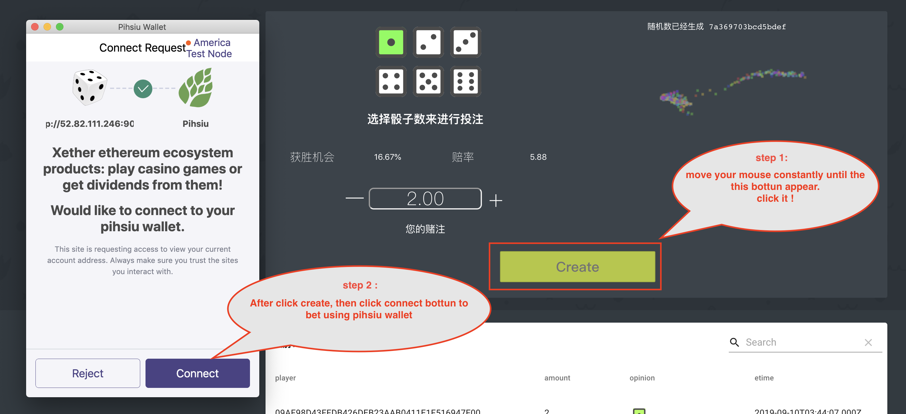
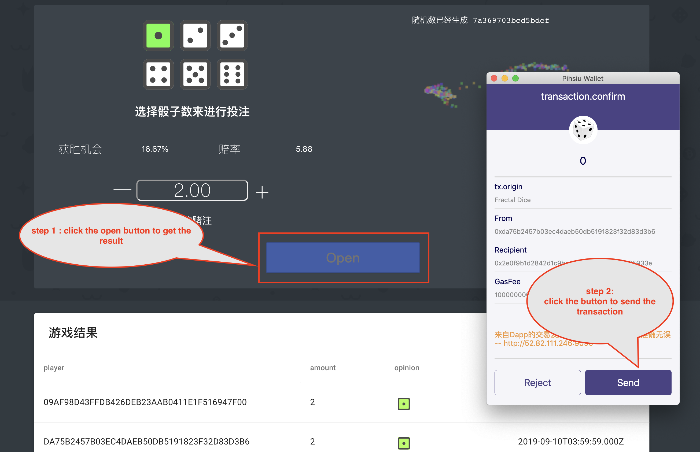
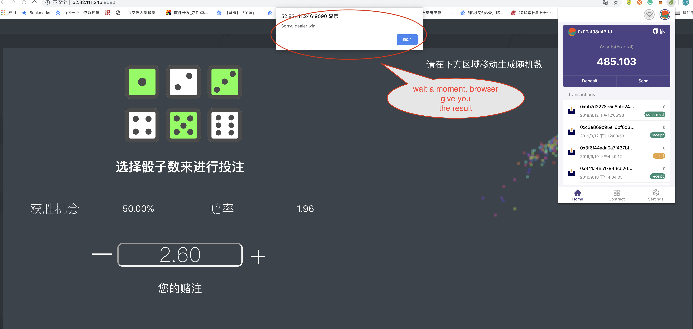
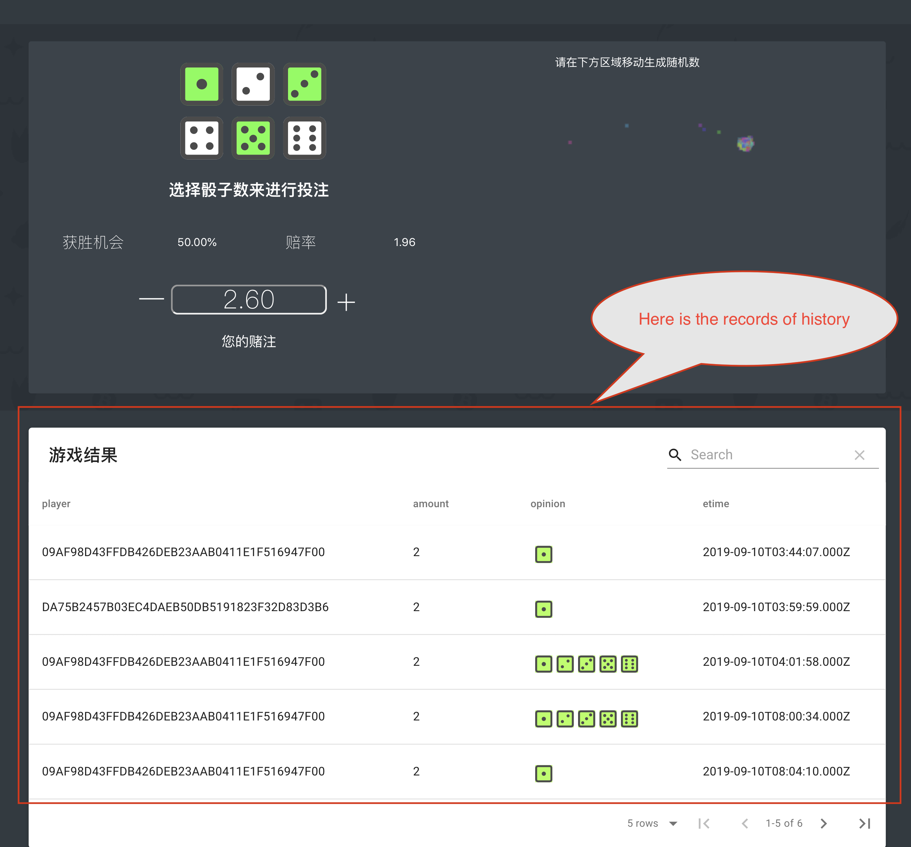
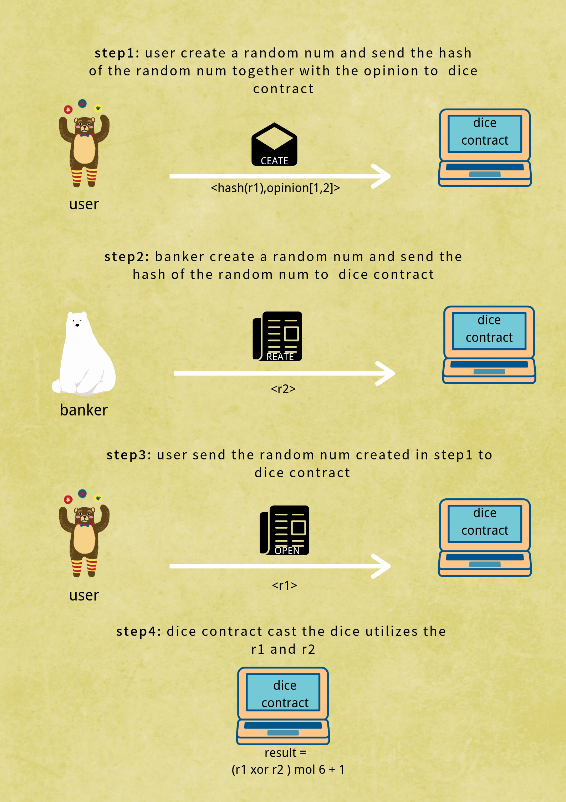

# Dice game
Before play the dice game, you should have [pihsiu wallet plugin](https://github.com/fractal-platform/pihsiu) in chrome browser and have some token of fractal test net.
You can apply some token in [here](http://token.fractalblock.com).

## Start Dice Game

### Step 1 Make a choice 

1.Choose the point you bet on(at most 5).

2.choose the amount you bet on

### Step 2 Create a random number

Move the mouse constantly in the square until "create" button appear on the screen ,then click the botton.

In this step, the dapp generates a random number by sampling the track of moving of user's mouse. 

### Step 3 Get the result

When a "open" button on the screen, then click it. 

Then wait a moment and you will get the result of your bet.

### Step 4 Record of history
At the bottom of the page, you can view the record of history.

## Fairer game  
To guarantee the fairness, this dapp generate a random both user and banker.

